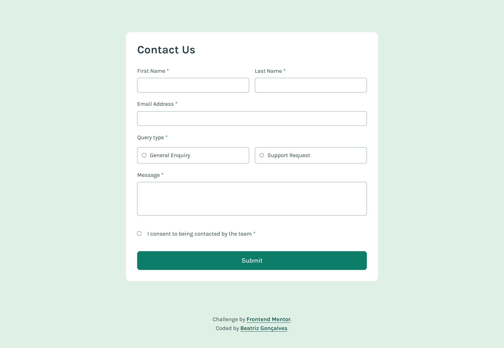

# Frontend Mentor - Contact form solution

Essa é a solução para o [Contact form challenge on Frontend Mentor](https://www.frontendmentor.io/challenges/contact-form--G-hYlqKJj).  Os desafios do Frontend Mentor ajudam você a melhorar suas habilidades de codificação através da construção de projetos realistas.

## Tabela de conteúdo

- [Frontend Mentor - Contact form solution](#frontend-mentor---contact-form-solution)
  - [Tabela de conteúdo](#tabela-de-conteúdo)
  - [Visão Geral](#visão-geral)
    - [O desafio](#o-desafio)
    - [Screenshot](#screenshot)
      - [Desktop:](#desktop)
      - [Mobile:](#mobile)
    - [Links](#links)
  - [Meu processo](#meu-processo)
    - [Construído com](#construído-com)
    - [O que eu aprendi](#o-que-eu-aprendi)
    - [Desenvolvimento contínuo](#desenvolvimento-contínuo)
  - [Autora](#autora)

## Visão Geral

### O desafio

Seus usuários devem ser capazes de:

- Preencher o formulário e ver uma mensagem de sucesso após o envio bem-sucedido
- Receba mensagens de validação do formulário se:
  - Um campo necessário estiver faltando
  - O endereço de e-mail não estiver formatado corretamente
- Preencher o formulário apenas usando o teclado
- Ter campos, mensagens de erro e a mensagem de sucesso anunciada em seu leitor de tela
- Ver o layout ideal para a interface, dependendo do tamanho da tela do dispositivo
- Ver os estados de passar o mouse e foco para todos os elementos interativos na página

### Screenshot

#### Desktop:

#### Mobile:

### Links

- Solução URL: [Frontend Mentor](https://www.frontendmentor.io/solutions/contact-form-validation-keyboard-navigation-css-grid-aria-n4ay8OFLAN)
- Site URL: [GitHub Pages](https://beatrizvsgoncalves.github.io/contact-form-main/)

## Meu processo

### Construído com

- Tags Semânticas
- Flexbox
- CSS Grid
- Mobile-first Workflow
- Media Queries
- Atributos ARIA
- JavaScript
- Módulos

### O que eu aprendi

Esse foi o projeto em que mais precisei de tempo, uma das razões sendo que este foi meu primeiro formulário com validação. E além disso, uns dos requisitos era elementos sendo anunciados no leitor de tela, por isso resolvi estudar um pouco mais sobre acessibilidade. Aprendi muito com este projeto, estou muito satisfeita.

### Desenvolvimento contínuo

Este projeto foi bem importante pra mim. É o projeto mais complexo em JavaScript que fiz totalmente sozinha. Depois de alguns projetos frustrados, com este eu consegui perceber minha evolução no aprendizado de programação.

## Autora

- Github - [beatrizvsgoncalves](https://github.com/beatrizvsgoncalves)
- LinkedIn - [beatriz-vs-goncalves](https://www.linkedin.com/in/beatriz-vs-goncalves/)
- Frontend Mentor - [@beatrizvsgoncalves](https://www.frontendmentor.io/profile/beatrizvsgoncalves)